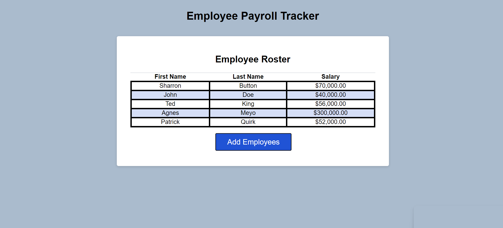

# Employee payroll tracker

This is an application that allows the user to track employee salaries. When the "Add employee" button is pressed
the user is prompted to enter the employee's first and last name as well as their salary. Once the user adds an employee,
the employee's name and salary are added to chart. Then the chart is then updated to be sorted alphabetically by last name.

